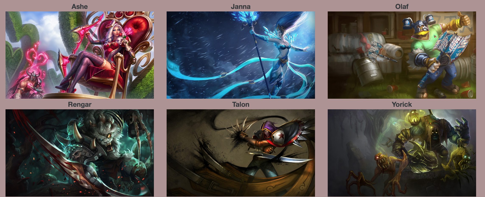
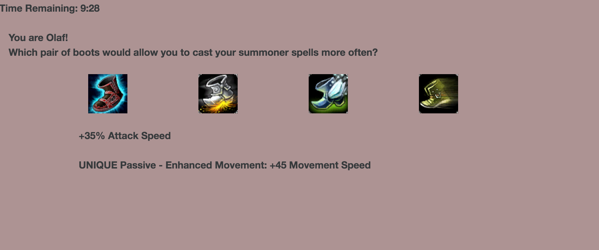
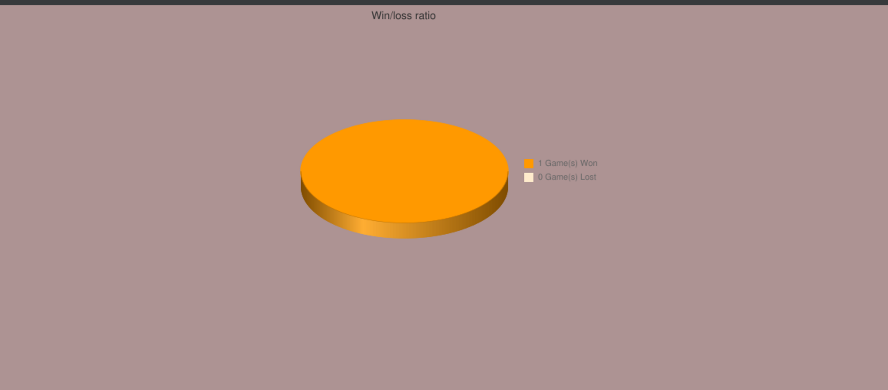

#Welcome to the Summoner's Universe!

Welcome! This web app will help you to improve your League of Legends' game.
 

By selecting a hero, you will be led into your game, where you will have 10 minutes to solve all the questions provided. Each question will have four answers, or items, to select from. Not to worry-just hover over each item to get a description. You'll probably find some helpful hints!

THis website is built with a responsive design, but the best user experience comes on desktop

<a href="https://summoners-universe.herokuapp.com">
Click here to visit the site!
</a>

#Technologies
<ul>
  <li>Back End: Rails, Active Record, PostgreSQL</li>
  <li>Front End: HTML, CSS, JavaScript, AngularJS, jQuery, Bootstrap</li>
  <li>APIs: League of Legends</li>
  <li>User Auth: Devise</li>
</ul>

#Installation

If you wish to view/run the code locally, clone this to your computer and bundle from the command line.

#Usage

Summoner's Universe is designed as a question-and-answer game. Once you create your profile, you can choose from a list of heroes to begin battle. At this time, there is no difference between the heroes

  
Welcome Page, after logging in.

  

Once you select a hero, you are taken to the battle page. Answer all the questions correctly, and you'll win the game! Run out of time...and you lose!

  
Welcome Page, after logging in.

  

Your win/loss ratio is tracked internally, and displayed via pie graph on your profile page

  
Welcome Page, after logging in.

  

#The Team
<ul>
  <li>Peter Leong</li>
  <li>Jonathan Silvestri</li>
</ul>

#License
<h3>The MIT License (MIT)

Copyright (c) 2016 summoners-universe</h3>

Permission is hereby granted, free of charge, to any person obtaining a copy
of this software and associated documentation files (the "Software"), to deal
in the Software without restriction, including without limitation the rights
to use, copy, modify, merge, publish, distribute, sublicense, and/or sell
copies of the Software, and to permit persons to whom the Software is
furnished to do so, subject to the following conditions:

The above copyright notice and this permission notice shall be included in all
copies or substantial portions of the Software.

THE SOFTWARE IS PROVIDED "AS IS", WITHOUT WARRANTY OF ANY KIND, EXPRESS OR
IMPLIED, INCLUDING BUT NOT LIMITED TO THE WARRANTIES OF MERCHANTABILITY,
FITNESS FOR A PARTICULAR PURPOSE AND NONINFRINGEMENT. IN NO EVENT SHALL THE
AUTHORS OR COPYRIGHT HOLDERS BE LIABLE FOR ANY CLAIM, DAMAGES OR OTHER
LIABILITY, WHETHER IN AN ACTION OF CONTRACT, TORT OR OTHERWISE, ARISING FROM,
OUT OF OR IN CONNECTION WITH THE SOFTWARE OR THE USE OR OTHER DEALINGS IN THE
SOFTWARE.
